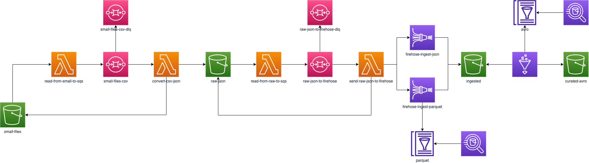

# FIAP Exploring Database Options

## Grupo

* Bernardo Couto
* Raphael Freixo
* Ronaldo Nolasco

## Dataset

* **URL**: https://www.kaggle.com/elemento/nyc-yellow-taxi-trip-data
* **Tamanho**: 7 GB

## Arquitetura

## Deploy

Toda a infra-estrutura foi construída utilizando o conceito de IaC através do Serverless Framework.

Além disso, o workflow de CI/CD foi construído com o GitHub Actions conforme descrito no arquivo [deploy.yaml](./.github/workflows/deploy.yaml).
